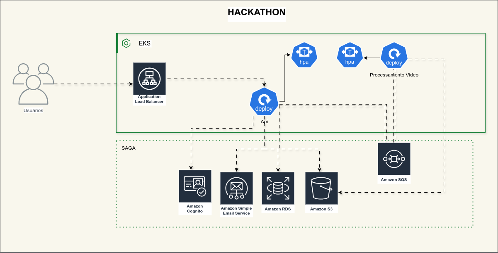
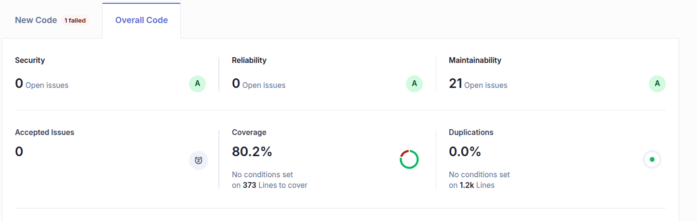
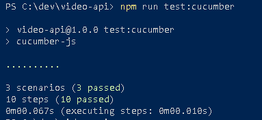

# Hackaton 

## Integrantes do grupo 22 
- Edson Pereira de Andrade
- Evelly Cristina Cramolish Palombo Santos 
- Gabriel Fernandes Lazari 
- Marcelo Rodrigues
- Wagner Sanches

## Tecnologias
Essa api foi desenvolvivida usando as seguintes tecnologias:
 - Nestjs;
 - TypeORM;
 - Banco de dados Postgres, utilizando o RDS da Amazon
 - Migrations
 - Docker e Dockerhub para armazernar as imagens.
 - Filas, utilizando SQS da Amazon 
 - Email, utilizando SES da Amazon
 - Kubernetes para deploy das aplicações
 - Sonar.IO para validação da cobertura de testes
 - Swagger para realizar a documentação da api
 - Jest Framework para realizar os testes unitários


 ## Arquitetura
 

 ## Arquitetura clean code
Utilizamos a arquitetura Clean Code pois ela promove um código legível, manutenível e extensível, além de permitir a fácil substituição de tecnologias utilizadas em componentes externos, como gateways, sem a necessidade de alterações no core da aplicação.

## Banco de Dados

Optamos pelo banco de dados Postgres para salvar as informações dos vídeos por se tratar de um banco robusto com suporte a transações. 


## Swagger

Todos os endpoint estão documentos utilizando o Swagger, o endereço disponível após subir a aplicação é:

```
  http://localhost:3000/api-docs
```  


## Testes realizados


## Testes de BDD

Os testes de BDD são executados utilizando o Cucumber. Abaixo está uma evidência dos testes:


